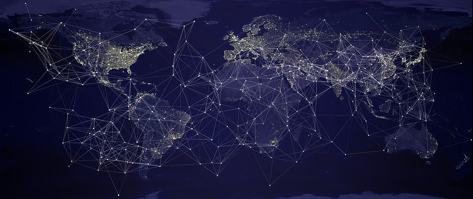

# Guión de Internet y sus plataformas

### Objetivo

Mediante esta clase se pretende mostrar de manera sencilla qué es internet, los usos que tiene y lo que puede llegar a suponer en un futuro cada vez más conectado. Además, se pretende que el alumno comprenda qué es un fichero "*html*" y que programe por primera vez una página web, herramienta indispensable para todo futuro profesional. Para ello, además de la clase, se llevará a cabo una pequeña práctica de programación html.

| Contenido | Duración |
| ----- | ----- |
| **Clase** | **1 hora - 1 hora y 30 minutos** |
| Introducción: Definición de conceptos previos | 20-30 minutos |
| **Práctica programación html** | **30 minutos** |

***

## Introducción, definición de conceptos previos: Internet y la World Wide Web

### Deficinión de internet:

*Definición técnica:* 

+ [Link 1](https://es.wikipedia.org/wiki/Internet): *Artículo de wikipedia que aclara los conceptos técnicos*
+ [Link 2](https://www.fundeu.es/recomendacion/internet-terminos-relacionados-1315/):  «internet, claves de redacción». Fundeu. Consultado el 10 de Junio de 2018.

*Articulo de divulgación:* 

+ [Link 3](https://definicion.de/internet/):Qué es, Significado y Concepto

*Deficnición simple:*

+ [Link 4](https://www.google.com/search?q=internet+definicion&rlz=1C1CHBD_esES774ES778&oq=internet+defi&aqs=chrome.0.0j69i57j0l4.3876j1j4&sourceid=chrome&ie=UTF-8): *Diccionario google*

> Red informática de nivel mundial que utiliza la línea telefónica para transmitir la información.

### Deficinión de la World Wide Web (WWW):

+ [Link 1](https://es.wikipedia.org/wiki/World_Wide_Web) *Artículo de wikipedia que aclara los conceptos técnicos*
+ [Link 2](https://developer.mozilla.org/es/docs/Glossary/World_Wide_Web): Definición alternativa.
+ Bibliografia: *Fielding, R.; Gettys, J.; Mogul, J.; Frystyk, H.; Masinter, L.; Leach, P.; Berners-Lee, T. (junio de 1999). Hypertext Transfer Protocol — HTTP/1.1. Request For Comments 2616. Information Sciences Institute. Consultado el 10 de Junio de 2019*

> En informática, la World Wide Web (WWW) o red informática mundial es un sistema de distribución de documentos de hipertexto o hipermedia interconectados y accesibles a través de Internet. Con un navegador web, un usuario visualiza sitios web compuestos de páginas web que pueden contener textos, imágenes, vídeos u otros contenidos multimedia, y navega a través de esas páginas usando hiperenlaces.

### Diferencia entre internet y la World Wide Web (WWW):

+ [Link](https://es.wikipedia.org/wiki/Internet) 

> Uno de los servicios que más éxito ha tenido en internet ha sido la World Wide Web (WWW o la Web), hasta tal punto que es habitual la confusión entre ambos términos. La WWW es un conjunto de protocolos que permite, de forma sencilla, la consulta remota de archivos de hipertexto. Esta fue un desarrollo posterior (1990) y utiliza internet como medio de transmisión.

> Existen, por tanto, muchos otros servicios y protocolos en internet, aparte de la Web: el envío de correo electrónico (SMTP), la transmisión de archivos (FTP y P2P), las conversaciones en línea (IRC), la mensajería instantánea y presencia, la transmisión de contenido y comunicación multimedia —telefonía (VoIP), televisión (IPTV)—, los boletines electrónicos (NNTP), el acceso remoto a otros dispositivos (SSH y Telnet) o los juegos en línea.

[Source](https://es.wikipedia.org/wiki/Internet)

## Definicón de lo que es un **hipertexto**

Project 1989: *En esta web, se describen lo que es la World Wide Web mostrando de manera clara y sencilla lo que es un hypertexto, la propia explicación sirve a modo de ejemplo* 

### Deficiniciones de conceptos como http, url, etc:
+ [Link 1](https://prezi.com/yy1qvuk2vhtj/que-significan-los-terminos-html-http-tcp-ip-lan-www/): *presentación prezi donde se aclaran múltiples conceptos, el profesor decidirá cuantos y cuales incluir.* 
+ [Link 2](http://info.cern.ch/hypertext/WWW/TheProject.html): *Hypertext system: http, html, url*

Introducción a la web: *Presentación donde se definen conceptos previos, se muestan ejemplos y se diferencian los conceptos de http, html,url de manera sencilla y clara:*

+ [Link](https://es.slideshare.net/jsalvachua/introducin-a-la-web-http-url-y-html-presentation): *Introdución a la web: HTTP, URL y HTML. 1. Arquitectura de la Web : HTTP, URL y HTML*

+ Imagen explicativa:

## Plataformas de Internet
